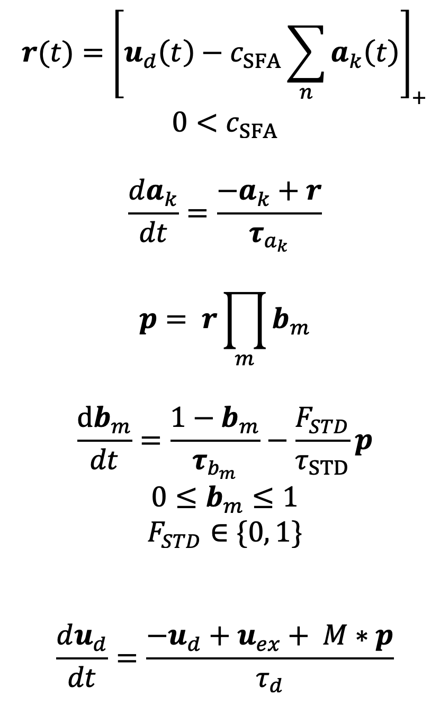

# StableRandomNonlinearNets

This is a theoretical neuroscience project investigating two forms of adaptation found in the brain: (1) weight adaptation and (2) bias adaptation. Mechanistically these most closely align with short-term synaptic depression and spike frequency adaptation, respectively. We model the effect of dual adaptation on continuous time recurrent neural networks.

## Project Overview

Our neural network model includes:
- **Excitatory and inhibitory neurons** obeying Dale's principle
- **Rectifying (ReLU) neurons** with nonlinear dynamics
- **Adaptation only in excitatory neurons** - when there is high activity, weight and bias adaptation reduce the output of the E neurons, allowing the I neurons to "win" (i.e., dynamically balance the E neurons)

## Model Equations

The model consists of **n neurons** with the following variable dimensions:
- **r**, **u_d**, **u_ex**, and **p** are **n × 1 vectors**
- **M** is an **n × n** connectivity matrix
- Each neuron has **k** adaptation state variables **a_k** 
- Each neuron has **m** bias adaptation state variables **b_m**
- Each neuron has **one dendrite state variable u_d**
- The **total state size** is therefore **n × k + n × m + n × 1**
- **r** and **p** are derived quantities from the state variables
- **c_SFA**, **F_STD**, **τ_d**, and **τ_STD** are typically scalars, but **c_SFA** and **F_STD** are set to zero for inhibitory neurons

## Adaptation Control Parameters

The model now includes explicit control over which adaptation mechanisms are applied to each neuron through two key parameters:

- **c_SFA**: Controls the strength of **Spike Frequency Adaptation (SFA)** for each neuron. This parameter determines the bias adaptation component, where higher values lead to stronger adaptation of the neuron's bias term in response to sustained activity.

- **F_STD**: Controls the strength of **Short-Term Depression (STD)** for each neuron. This parameter determines the weight adaptation component, where higher values lead to stronger adaptation of synaptic efficacy in response to presynaptic activity.

These parameters allow for fine-grained control over the adaptation profile of individual neurons:
- Setting **c_SFA = 0** disables spike frequency adaptation for that neuron
- Setting **F_STD = 0** disables short-term depression for that neuron  
- Both parameters are typically set to zero for **inhibitory neurons**, ensuring adaptation only occurs in excitatory populations
- The parameters can be neuron-specific vectors, allowing heterogeneous adaptation profiles across the network

This explicit parameterization enables systematic investigation of how different combinations of adaptation mechanisms affect network dynamics and stability properties.

## Research Questions

Our primary research focus examines:

Motivating question: How are global dynamical properties maintained through **biologically plausible** (i.e., local) development rules? The stability of LTI dynamical systems (i.e, systems of first-order differential equations) are 100% determined by connectivity (i.e., eigenvalues). Is this true for biomimetic recurrent nonlinear networks?

Hypothesis: We hypothesize that dual adaptation helps decouple global dynamical properties from the details of connectivity. We expect that the time constants of adaptation will play a role.

## Methodology

We investigate the worst case scenario where synaptic weights are drawn from a random distribution, an approach used in **random matrix theory**. We extend concepts of random matrix theory to our nonlinear RNN by:
- Simulating random networks
- Computing the Lyapunov spectrum
- Determining the level of chaos with the **Kolmogorov-Sinai entropy**

## Current Status and Roadmap

### ✅ Completed
- [x] Created a **Lorenz test system** with known largest Lyapunov exponent for algorithm verification
- [x] Implemented **Benettin's method** for Lyapunov exponent calculation

### 🔄 In Progress / Planned
- [ ] Implement **QR factorization** to compute the full Lyapunov spectrum
- [ ] Update README with **LaTeX equations** for the RNN model
- [ ] Write **MATLAB function** for the nonlinear RNN
- [ ] Create **example implementations** using the RNN function
- [ ] Perform **sensitivity analysis** of connectivity distribution parameters
- [ ] Incorporate figures into manuscript (already written based on prior code base)

## License

MIT License 

## Notes:
We need to remove unused states due to c_SFA and F_STD because they cause a false zero Lyapunov exponent for systems which are stable!
And systems which are truely edge of chaos maybe difficult to measure with Benettins method.