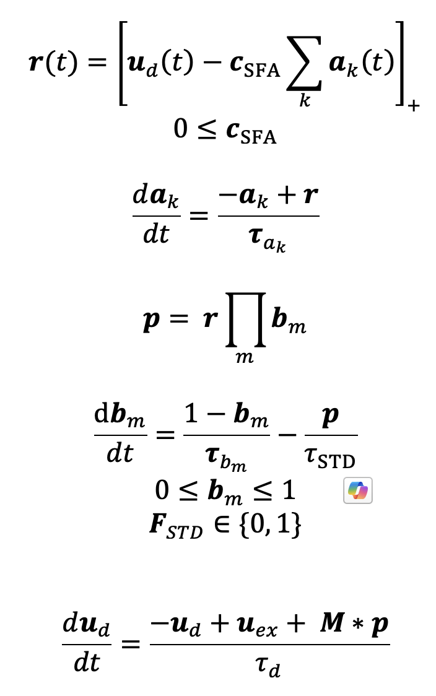

# StableRandomNonlinearNets

This is a theoretical neuroscience project investigating two forms of adaptation found in the brain: (1) weight adaptation and (2) bias adaptation. Mechanistically these most closely align with short-term synaptic depression and spike frequency adaptation, respectively. We model the effect of dual adaptation on continuous time recurrent neural networks.

## How to Run the code

### Setup
- Run fig_scripts/set_SRNN_paths.m, which will add all necessary paths to run all scripts
- Optional: fig_scripts/set_fig_defaults.m, which will modify the default line widths, font sizes, and lines colormap until Matlab is restarted.

### Basic and advanced examples
- fig_scripts/basic_example/SRNN_basic_example.m % a basic example with all of the extras removed
- fig_scripts/advanced_example/SRNN_adv_example.m % an example with many extras added

### Figures for the paper are in fig_scripts/SRNN_paper
- Fig 1: fig_scripts/SRNN_paper/tseries_example/SRNN_example_tseries.m

- Fig 2: first: fig_scripts/SRNN_paper/sensitivity_analysis/sensitivity_analysis.m
         second: fig_scripts/SRNN_paper/sensitivity_analysis/sensitivity_plot_caller.m

- Fig 3: first: fig_scripts/SRNN_paper/parameter_space_analysis/network_parameter_space_analysis.m
         You can stop network_parameter_space_analysis.m after about 15 minutes.  
         second: run fig_scripts/SRNN_paper/parameter_space_analysis/consolidate_parameter_space_results.m to consolidate data created in previous step
         third: fig_scripts/SRNN_paper/parameter_space_analysis/plot_parameter_space_results.m

- Fig 4: first: fig_scripts/SRNN_paper/tau_a_E_edge_of_chaos/tau_a_sensitivity_analysis.m
         second: fig_scripts/SRNN_paper/tau_a_E_edge_of_chaos/tau_a_sensitivity_plot_caller.m

- Fig 5: fig_scripts/SRNN_paper/IEDs_example/SRNN_caller_example_tseries.m 

## Project Overview

Our neural network model includes:
- **Excitatory and inhibitory neurons** obeying Dale's principle
- **Rectifying (ReLU) neurons** with nonlinear dynamics
- **Adaptation only in excitatory neurons** - when there is high activity, weight and bias adaptation reduce the output of the E neurons, allowing the I neurons to "win" (i.e., dynamically balance the E neurons)

## Model Equations

The model consists of **n neurons** with the following variable dimensions:
- **r**, **u_d**, **u_ex**, and **p** are **n × 1 vectors**
- **M** is an **n × n** connectivity matrix
- Each neuron has **k** adaptation state variables **a_k** 
- Each neuron has **m** bias adaptation state variables **b_m**
- Each neuron has **one dendrite state variable u_d**
- The **total state size** is therefore **n × k + n × m + n × 1**
- **r** and **p** are derived quantities from the state variables
- **c_SFA**, **τ_d**, and **τ_STD** are constants

## Research Questions

Our primary research focus examines:

Motivating question: How are global dynamical properties maintained through **biologically plausible** (i.e., local) development rules? The stability of LTI dynamical systems (i.e, systems of first-order differential equations) is 100% determined by connectivity (i.e., eigenvalues). Is this true for biomimetic recurrent nonlinear networks?

Hypothesis: We hypothesize that dual adaptation helps decouple global dynamical properties from the details of connectivity. We expect that the time constants of adaptation will play a role.

## Methodology

We investigate the worst case scenario where synaptic weights are drawn from a random distribution, an approach used in **random matrix theory**. We extend concepts of random matrix theory to our nonlinear RNN by:
- Simulating random networks
- Computing the Lyapunov spectrum

## Current Status and Roadmap

### ✅ Completed
- [x] Created a **Lorenz test system** with known largest Lyapunov exponent for algorithm verification
- [x] Implemented **Benettin's method** for Lyapunov exponent calculation
- [x] Implemented **Benettin's QR factorization** methods to compute the full Lyapunov spectrum
- [x] Write **a MATLAB function** for the nonlinear RNN
- [x] Perform **sensitivity analysis** of connectivity distribution parameters

### 🔄 In Progress / Planned
- [ ] Add a fixed point solver for ICs
- [ ] Add an analytic LLE solver for comparison

## License

MIT License 